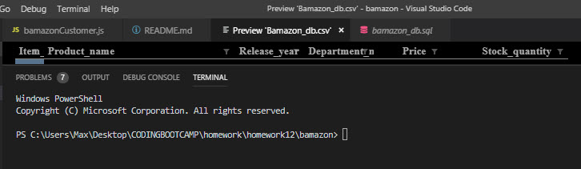
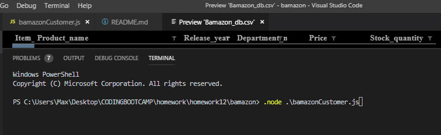
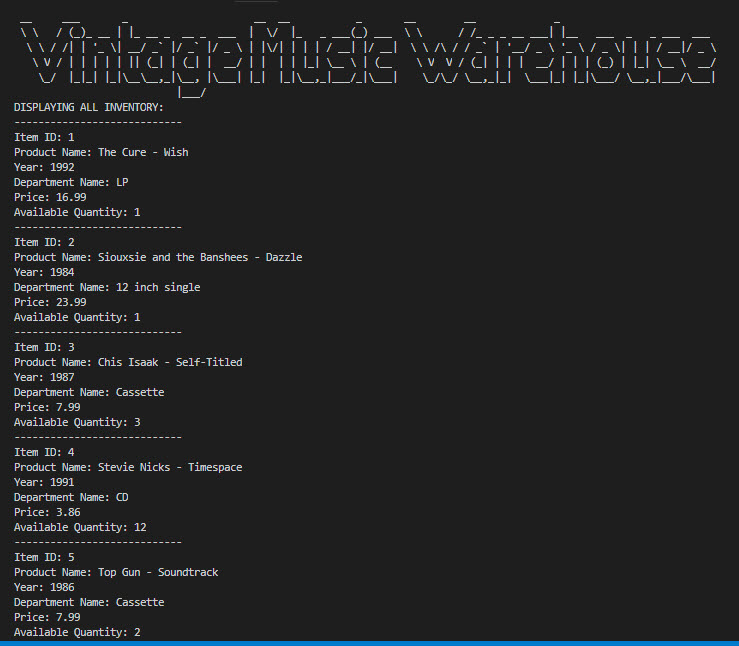
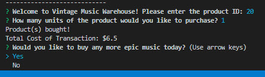
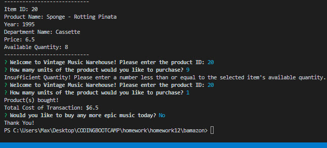

-----------------------------------------

# **Bamazon** (Week 12 Homework - *University of Arizona Coding Bootcamp*, Jan. 2019 Cohort)

-----------------------------------------

## Welcome to my Bamazon Store Front - VINTAGE MUSIC WAREHOUSE
##  *Find your favorite retro post-punk and early-alternative music favorites on vintage format*.

-----------------------------------------

## This is a mock online store inventory database. It allows users to select a product and 'buy' a quantity of that item. The MySQL database updates when the user chooses to buy products. 

## This app utilizes Node.js, MySQL and [Inquirer](https://www.npmjs.com/package/inquirer/).

-----------------------------------------

## HOW IT WORKS

### Upon running the program, the user will be shown all of the inventory in the database, and is asked to give the ID of the product they would like to purchase.

### After the user gives the ID of the product, then they are asked how many units of the product they would like to buy. If the number entered is less than or equal to the current inventory number, then the number is subtracted from the available quantity. Next, the new quantity is updated in the MySQL database. The user is ginen a prompt that the product has been bought along with the total amount for the transaction. Lastly, the user is given the option to shop again. 

### If the user types in a quantity that is larger than the currently available quantity for the chosenproduct, an error message renders and they are taken back to begin again.

-----------------------------------------

## SEE THE WORKING CODE

### 1. Open bamazon store front in terminal

### 2. Enter 'node bamazonCustomer.js' into command line

### 3. The [Figlet](https://www.npmjs.com/package/figlet) package renders store name and the product database follows

### 4. Prompt to enter the: 'product id' & 'quantity'; transaction total & shop again (y/n) option

### 5. Example of an 'insufficient quantity' entered

### 6. Example 5, followed by shop again 'no' functionality

-----------------------------------------

### Built With
* Node.js
* JavaScript 
* Node Package Manager (npm)
* MySQL

### NPM's Used
* [Figlet](https://www.npmjs.com/package/figlet) - This project aims to fully implement the FIGfont spec in JavaScript.
* [Inquirer](https://www.npmjs.com/package/inquirer) - A collection of common interactive command line user interfaces.
* [MySQL](https://www.npmjs.com/package/mysql) - This is a node.js driver for mysql.

-----------------------------------------

##### My name is Max Jackson, and [I am a web developer in the making](https://maxjcoder.github.io/Bootstrap-Portfolio/index.html). (c) 2019

