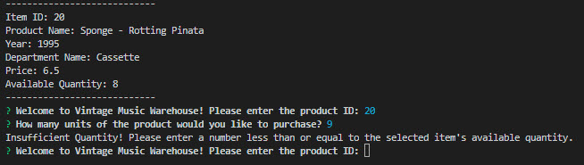

-----------------------------------------

# **Bamazon** (Week 12 Homework - *University of Arizona Coding Bootcamp*, Jan. 2019 Cohort)

-----------------------------------------

## Welcome to my Bamazon Store Front - VINTAGE MUSIC WAREHOUSE
##  *Find your favorite retro post-punk and early-alternative music favorites on vintage format*.

-----------------------------------------

## This is a fictitious online store inventory database that allows users to select a product and 'buy' a quantity of that item. The MySQL database get's updated when the user chooses to buy products. 

## This app utilizes Node.js, MySQL and [Inquirer](https://www.npmjs.com/package/inquirer/).

-----------------------------------------

## HOW IT WORKS

### Upon running the program, the user will be shown all of the inventory in the database, and will be asked to give the ID of the product they would like to purchase.

### Once the user gives the ID of the product, they are asked how many units of the product they would like to buy. Once they enter the amount, if the number that they entered is less than or equal to the current inventory number for the selected product, then the inputted number is subtracted from the product's available quantity and the product's new quantity is updated in the MySQL database. The user is shown a message stating that the products have been bought along with the total cost of their transaction. They are then asked whether they would like to shop again 

### If the user types in a quantity that is larger than the current available quantity for the product that they have chosen, then an error message pops up, and they are taken back to the starting prompt.

-----------------------------------------

## SEE THE WORKING CODE

-----------------------------------------

### Built With
* Node.js
* JavaScript 
* Node Package Manager (npm)
* MySQL

### NPM's Used
* [Figlet](https://www.npmjs.com/package/figlet) - This project aims to fully implement the FIGfont spec in JavaScript.
* [Inquirer](https://www.npmjs.com/package/inquirer) - A collection of common interactive command line user interfaces.
* [MySQL](https://www.npmjs.com/package/mysql) - This is a node.js driver for mysql.

-----------------------------------------

##### My name is Max Jackson, and [I am a web developer in the making](https://maxjcoder.github.io/Bootstrap-Portfolio/index.html). (c) 2019

